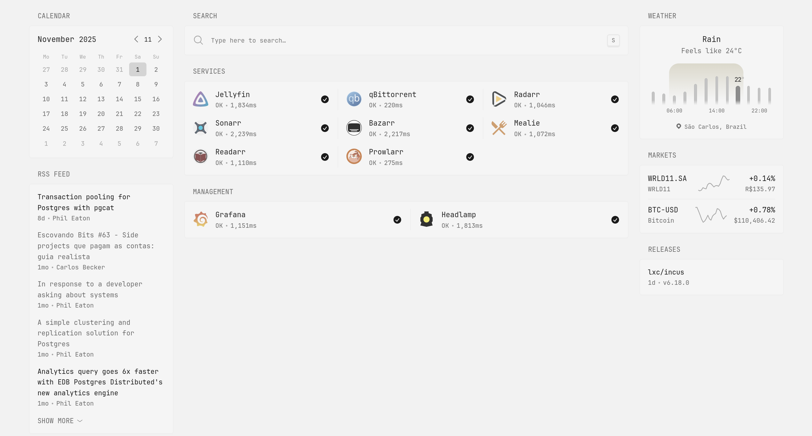
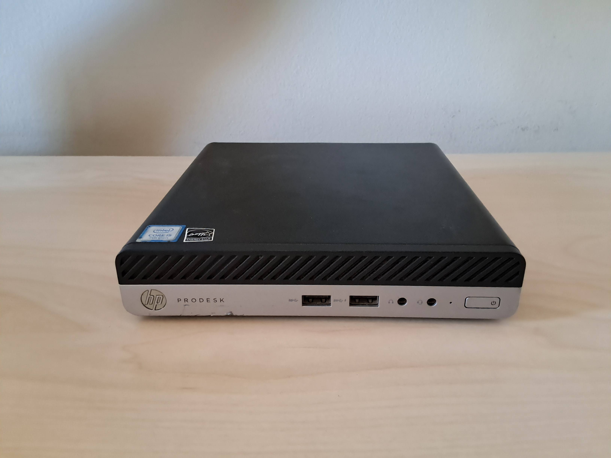
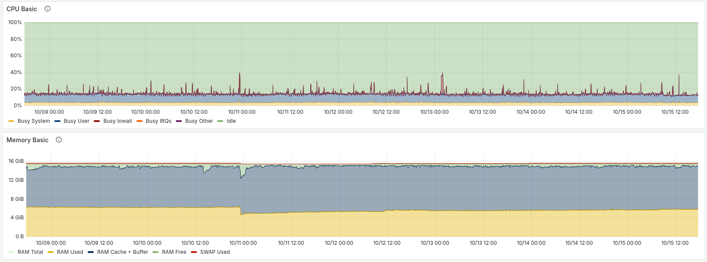

2 years ago I started my homelab project. The idea was to have a **practical long-term project** in which I could learn more about Kubernetes and infrastructure in general. It's been a great journey!

In this post, I'll describe the current state of my setup and highlight a few key things I learned along the way. I plan on doing some big changes in the near future, so this post will also serve as a way to reflect on what I like about this setup and what could be improved.

My setup has changed a lot over time. But in the last year or so it has stabilized quite a bit, and I rarely change it in any significant way. This current iteration of my homelab fulfills the following properties:

- GitOps: everything is declarative and reproducible with FluxCD
- Secrets are encrypted and stored in the git repository
- All services have valid SSL certificates issued by Let's Encrypt
- Hardware acceleration enabled for video transcoding
- Observability for both the services and the node itself
- It's fun :)

If you want to check out the details about my setup, check out [the GitHub repository](https://github.com/luissimas/homelab). Since I'm using GitOps, **everything that I run is declared in this repository**.

My homelab runs as single node Kubernetes cluster (I'm using K3s) that hosts all my services. The Kubernetes deployments and configuration are entirely managed in a GitOps workflow, using FluxCD. The OS running in the node is Ubuntu Server 22.04. Besides the main K3s process, the node also runs Tailscale to setup a peer-to-peer VPN from my client devices to my server. All of this runs in a used Mini PC that sits quietly under my desk.

## What I'm currently running

My homelab runs a variety of services for different purposes. Here are the main questions I ask myself when deciding to deploy a new service:

- Will I **learn something** new by deploying and maintaining it?
- Will it **serve some purpose** to me or my family in my day to day life?
- Is it something that I'm **curious about** and want to try out?

If the answer to any of those questions is "yes" for a given service, then it earns a spot in the cluster.

I currently have about 47 pods with 120 containers running in my cluster. Most of these are Kubernetes services themselves, like CoreDNS, FluxCD components, custom operators that I've installed, etc. Which means that although there are dozens of pods in this cluster, I don't have that many user facing services.

Here's a non-exhaustive list of the services that I'm currently running:

- Jellyfin
- Glance
- Arr stack
- Mealie
- Headlamp
- Grafana
- Prometheus
- Loki
- [zettelkasten-exporter](https://github.com/luissimas/zettelkasten-exporter) (check it out, I've heard it's great if you happen to be an observability and note taking nerd)

## The hardware

On the hardware side, I started like many do: with an old laptop. It had pretty modest specs: an AMD dual core CPU, 4GB of RAM and 500GB of hard drive storage. It was perfectly fine for most of the tasks I threw at it.

Sadly, at one point I tried to watch an HEVC encoded movie in Jellyfin and noticed that it was practically impossible to watch due to the low framerate. This experience taught me that hardware accelerated transcoding is needed for some types of video encoding, and that the integrated graphics card of my old laptop didn't have support for that.

This event motivated me to buy the first (and so far the only) dedicated hardware to my homelab. The main thing I was looking for was an integrated GPU with QuickSync to enable hardware acceleration to transcode video files. I did some research and was convinced (and still am) that **used Mini PCs are the best hardware for a small homelab**. So, in February of 2024, I bought a used HP Elitedesk 800 G3 Mini, and its been serving me very well so far.

The specs are still not high end by any standards, but it is plenty for my needs. It has an Intel i5-7500T, 16GB of RAM and 1TB of SSD storage. The main highlight is that the integrated GPU (Intel HD Graphics 630) has QuickSync support, so it's able to perform hardware accelerated transcoding. Besides that, it also has some room for memory and storage upgrades, but I just haven't had the need yet.

To give you a better idea of resource consumption on this setup. This is the memory and CPU usage graph for the past week with everyday usage, which translates to mostly being idle during the day and streaming something from Jellyfin in the evenings.

## Networking

I don't have anything fancy in the network side of things. I just use my ISP router and plug the server directly to it via an Ethernet cable.

The only extra thing I have setup here is Tailscale. It runs in the server node and in all client devices that I want to grant access to the server. Tailscale provides a peer to peer VPN service. It's not really peer to peer, as it depends on a Tailscale coordinator service for the control plane. This coordinator service runs in Tailscale's infrastructure and is proprietary, but I'm not really worried about that currently.

The end result is that **I can access my server from anywhere in the world, just as if I were on my LAN**. I have full control of which devices are connected to the VPN and can easily add new devices when I need to.

If you want to know more about how things work under the hood, check out [how Tailscale works](https://tailscale.com/blog/how-tailscale-works). I think it's pretty great. There are some alternatives that solve the "proprietary coordinator service" problem, such as NetBird. I just never felt the need to explore other solutions.

## Things that I like

Since this post is a form of self-reflection into my current setup, I'll expand on some of the things that I really like about either my homelab itself or the journey of working on it.

### Learning Kubernetes

So far I'd say this has been the biggest benefit of my homelab. One of the main goals when starting it was to learn the basics of Kubernetes and get some experience with managing infrastructure. And I can say for sure that I've learned a lot in these past 2 years.

For me, **K3s hits the sweet spot** between being approachable enough for beginners but also leaving room for exploration with different components. The default CSI and CNI providers (for storage and networking) work great out of the box, but we can easily add more providers to explore different options. I can confidently say that I never felt limited by K3s at all.

I haven't explored much of the options in the CSI and CNI space yet. Since I have a single node, K3s's defaults are serving me very well. With that said, I've installed some extra operators in my cluster. Here's a non-exhaustive list:

- cert-manager for SSL certificates
- cloudnative-pg for PostgreSQL databases
- intel-device-plugin to detect my intel GPU and setup its passthrough to enable hardware accelerated video transcoding
- reflector to make the SSL certificate secrets available in different namespaces
- sealed-secrets to encrypt and decrypt the secrets in my cluster, enabling me to commit the encrypted secrets to git
- prometheus-operator and a bunch of other observability services

Maintaining this homelab and troubleshooting the occasional issues has taught me a lot about Kubernetes, and I feel like I've just scratched the surface of what it has to offer.

### Everything is declarative and reproducible

The GitOps workflow has been the central way in which I manage changes in my cluster. This has given me many benefits, such as:

- Having a history of all changes in the cluster via Git
- Easily being able to rollback some change if needed
- Ensuring that I can rebuild my setup from scratch without too much trouble

In this regard, **FluxCD has been a fantastic tool**. It just works and does its job very well. The only thing I missed was some web UI to get a pretty overview of the resources. But then I found Headlamp to fill this gap, and now I'd say I don't miss anything in this setup at all.

### "Real" SSL certificates everywhere

This might seem like a small thing, but it brings me a lot of joy: **all my services have a valid, Let's Encrypt signed certificate without being exposed to the internet**. Having "real" (i.e. non self signed) SSL certificates is a non-negotiable to me. Using self signed certificates and having to configure your own CA in every client device just feels hacky, and it always felt weird to me.

Issuing SSL certificates for publicly exposed services is quite simple and tools like cert-manager and certbot deal with that very easily. This makes sense, as that's a very common use case for most services. Things get a bit tricky when you want to have valid SSL certificates but don't want to expose your services to the internet. The DNS-01 challenge solves that, and I have a [blog post](../homelab-ssl) dedicated to the subject.

Since I'm using cert-manager, I use a [DuckDNS webhook implementation](https://github.com/joshuakraitberg/cert-manager-webhook-duckdns) to enable DNS-01 with my DNS provider.

### Enabling new projects

One not immediately obvious benefit of a homelab is that it **enables other projects**. Owning my own infrastructure to run applications has really motivated me to develop tiny services, even though they will probably be used just by me. I probably wouldn't have created [zettelkasten exporter](https://github.com/luissimas/zettelkasten-exporter) if I had to rent infrastructure in a public cloud to run it.

## Things that I want to improve

Nothing is perfect. There are some parts of my setup that currently bother me. I expect to address those in the future.

### Credentials for each service

There's no single identity provider in my homelab. This means that I have to **log into each service with their own set of credentials**.

It'd be really nice to share a single user and session between all my services. I'll definitely be looking into implementing some form of SSO in the near future.

### Limited host flexibility

By running K3s directly on the bare metal host, I **lost some flexibility** to mess around with the host itself. I want to have the ability to experiment with other Linux distros, add more nodes to my cluster to test HA scenarios, etc, but that's not easily done while running things directly in the bare metal host.

My plan for the near future is to use [Incus](https://github.com/lxc/incus) to get that flexibility. Instead of running K3s directly in the bare metal host, I'll run it in an LXC container managed by Incus. This then gives me the ability to spin up new containers and VMs to test things without impacting my main "production" cluster.

## Conclusion

Having a homelab is really fun. And it's also pretty easy to get started. All it takes is curiosity, some old hardware and a lot of patience to debug things. Chances are that you already have everything to get started!

That's it for an overview of my current setup. Feel free to leave any questions or suggestions in the comments below.

Thanks for reading!
