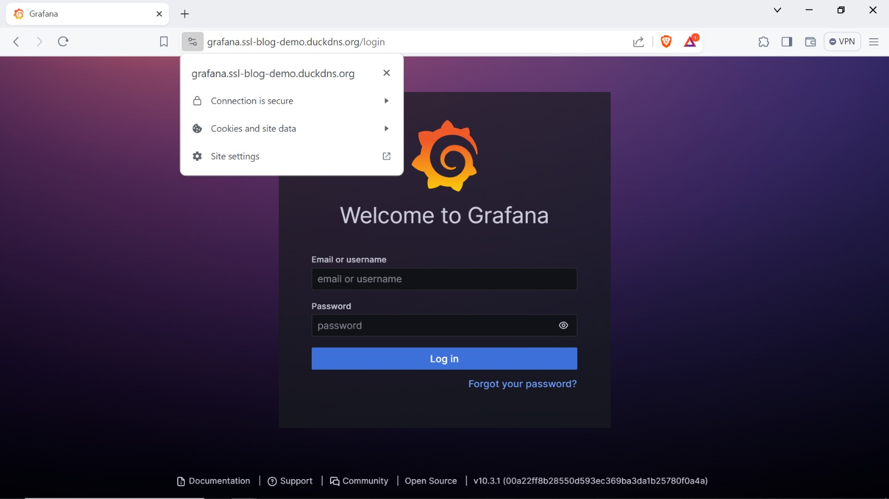
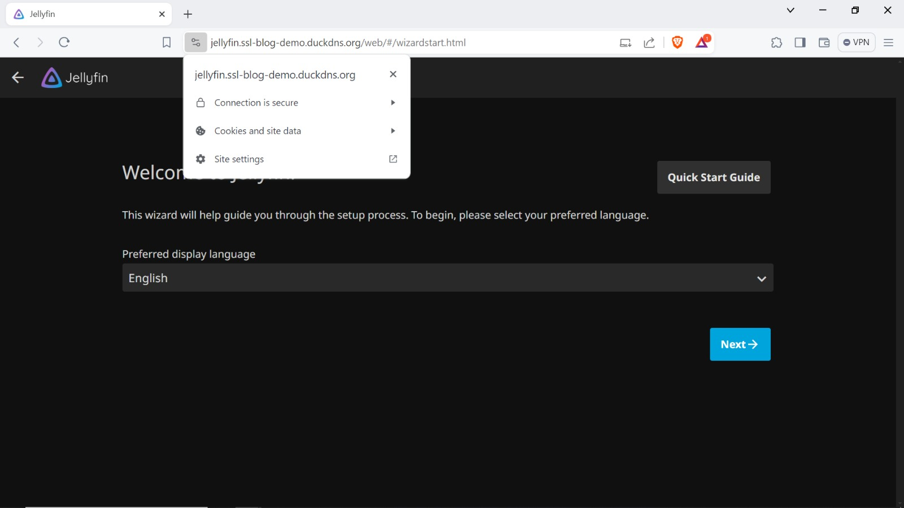

Lately I've been messing around with my homelab and I wanted to setup a custom domain and wildcard SSL certificates for all my services. I also didn't want to expose any services to the internet, so a traditional HTTP-01 ACME challenge was out of the question.

I've come across this [excelent blogpost](https://notthebe.ee/blog/easy-ssl-in-homelab-dns01/) by Wolfgang that explains an approach using the DNS-01 ACME challenge to eliminate the need for exposing any services to the internet. I tried it and it worked out great, but I wanted to use [Caddy](https://caddyserver.com/) as a reverse proxy, as I find it easier to configure and reproduce than [Nginx Proxy Manager](https://nginxproxymanager.com/). I fiddled a bit with Caddy's configuration and landed on a setup that I'm quite happy with, and that's what I'll share with you in this post.

## Pre-requisites

In this guide I'll assume that you already have a Linux distribution with Docker installed in your home server. I'm using Ubuntu Server 22.04.3 LTS and Docker version 25.0.3, but any Linux distro with a reasonably recent version of Docker should suffice. I'll also assume that you're somewhat familiar with the command line and with how Docker, HTTP and network ports work.

## How does it work?

In a traditional HTTPS-01 challenge, Let's Encrypt gives a token to the ACME client that stores it on the server with an account key. Once the file is ready, Let's Encrypt tries to retrieve it by making an HTTP request to the server. If the response is valid, the certificate is issued successfully. Note that this requires your server to be exposed to the internet so that Let's Encrypt can make an HTTP request to it. Also note that this method does not allow the issuing of wildcard certificates.

To circumvent those limitations we can use the DNS-01 challenge. This challenge works by putting a specific value in a TXT record under your domain name. Let's encrypt gives a token to the ACME client. The ACME client then creates a TXT record derived from that token and an account key and puts that record at `_acme-challenge.<YOUR_DOMAIN>`. Let's Encrypt can then query the DNS system for that record, and if it finds a match the certificate is issued successfully. The nice thing about this method is that there's no need to expose the server to the internet. With this type of challenge it is also possible to issue wildcard certificates.

If you wanna know more about the different types of ACME challenges I highly recommend Let's Encrypt's [documentation](https://letsencrypt.org/docs/challenge-types/) on the subject. I learned most of this stuff from there.

## Setting up the DNS record

The first step is to get a domain name and point that domain to our server's **local IP address**. There are several domain name providers out there, but a good and free option is [Duck DNS](https://www.duckdns.org/). That's what I'm currently using in my homelab, so I'll be using it for this guide. Keep in mind that you could use any domain name provider, as long as it supports DNS-01 challenges.


Take note of your Duck DNS token. We'll be using it to configure Caddy in the next step.

## Directory structure

In this guide we'll be running a couple of services using `docker compose`. The directory structure should look like this:

```text
.
├── docker-compose.yml
├── caddy
│   ├── Caddyfile
│   └── Dockerfile
└── homepage
```

## Setting up Caddy

We'll use Caddy's [official Docker image](https://hub.docker.com/_/caddy) to setup and run our reverse proxy.

Caddy has the concept of [modules](https://caddyserver.com/docs/modules/) that are basically plugins to extend it's functionality. There are several modules that provide integration with different DNS providers under the [caddy-dns](https://github.com/caddy-dns) GitHub organization. We'll use the [duckdns module](https://github.com/caddy-dns/duckdns) since that's the DNS provider we're using in this guide, but you could choose another module according to your DNS provider.

To use Caddy modules we must build a custom binary using the [xcaddy](https://github.com/caddyserver/xcaddy) tool. Luckily, Caddy provides a Docker image under the `<version>-builder` tag that helps us build custom Docker images with the modules we need. We'll setup our `Dockerfile` as follows:

```dockerfile
FROM caddy:2-builder AS builder

RUN xcaddy build --with github.com/caddy-dns/duckdns

FROM caddy:2

COPY --from=builder /usr/bin/caddy /usr/bin/caddy
```

We use a [multi-stage build](https://docs.docker.com/build/building/multi-stage/) that builds our custom binary with the duckdns module and copies it to the default Docker image. This ensures that the final image does not contain any build dependencies so we can keep it lean in size.

Next, we need to setup our `Caddyfile` so that Caddy manages the certificates for our domains using the duckdns module and act as a reverse proxy for our services. In this example I'd like to access my [homepage](https://gethomepage.dev/latest/) service using the ssl-blog-demo.duckdns.org domain and access my other services using the \*.ssl-blog-demo.duckdns.org subdomains.

```caddyfile
ssl-blog-demo.duckdns.org {
    tls {
        dns duckdns {env.DUCKDNS_API_TOKEN}
    }

    reverse_proxy localhost:3000
}

*.ssl-blog-demo.duckdns.org {
    tls {
        dns duckdns {env.DUCKDNS_API_TOKEN}
    }

    @jellyfin host jellyfin.ssl-blog-demo.duckdns.org
    handle @jellyfin {
        reverse_proxy localhost:8096
    }

    @grafana host grafana.ssl-blog-demo.duckdns.org
    handle @grafana {
        reverse_proxy localhost:3001
    }
}
```

In this example Caddy will automatically request and maintain a certificate for `ssl-blog-demo.duckdns.org` and a wildcard certificate for `*.ssl-blog-demo.duckdns.org`. We define the reverse proxy rules using the host of the requests to match our service's port on the local machine. Also note that we reference a `DUCKDNS_API_TOKEN` environment variable, so we don't need to expose this information in the configuration file.

Next, we declare our services using a docker compose file. I've prepared a sample `docker-compose.yaml` file with a couple of services for demonstration purposes. The main point of our interest is the `caddy` service.

Note that we specify the `DUCKDNS_API_TOKEN` environment variable in the `caddy` service. You should set this variable to the Duck DNS token that was obtained in the first step of this guide.

It's also important to mount a persistent volume to the path `/data` on the `caddy` service, since it's where the certificate files are stored and we don't want to loose them if the container is recreated.

```yaml
version: "3.8"

volumes:
  caddy_data:
  caddy_config:

services:
  caddy:
    build:
      dockerfile: "./caddy/Dockerfile"
    container_name: caddy
    restart: unless-stopped
    network_mode: host
    volumes:
      - ./caddy/Caddyfile:/etc/caddy/Caddyfile
      - caddy_data:/data
      - caddy_config:/config
    environment:
      DUCKDNS_API_TOKEN: <YOUR_DUCKDNS_API_TOKEN>

  homepage:
    image: ghcr.io/gethomepage/homepage:latest
    container_name: homepage
    restart: unless-stopped
    ports:
      - 3000:3000
    volumes:
      - ./homepage:/app/config
      - /var/run/docker.sock:/var/run/docker.sock

  grafana:
    image: grafana/grafana:latest
    container_name: grafana
    restart: unless-stopped
    ports:
      - 3001:3000

  jellyfin:
    image: lscr.io/linuxserver/jellyfin:nightly
    container_name: jellyfin
    restart: unless-stopped
    environment:
      - PUID=1000
      - PGID=1000
      - TZ=America/Sao_Paulo
      - JELLYFIN_PublishedServerUrl=192.168.0.243
    ports:
      - 8096:8096
```

And that's it! Running `docker compose up` in the current directory should bring up all the services and we should be able to access them using our domain and check that we have valid SSL certificates.

Accessing the `ssl-blog-demo.duckdns.org` URL we can verify that the request is proxied to the homepage service, and the SSL certificate is valid.


This also holds true for the services under the wildcarded domain:





With this setup, adding new services and domains is just a matter of adding a new entry in the `Caddyfile`.
