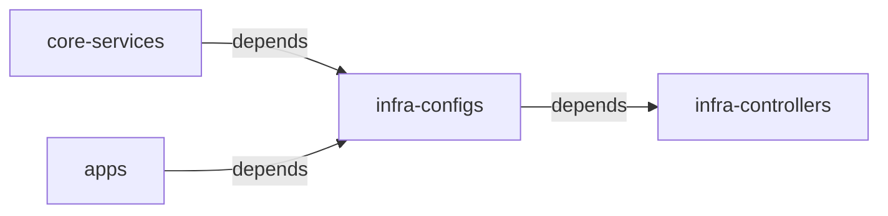

In my Homelab Kubernetes cluster, I run several **stateful applications** that store their data locally in persistent volumes. Recently, I wanted to migrate my old cluster to a new one, with improved hardware and better infrastructure management. I use a GitOps workflow with Flux, so I was confident that I could easily spin up my workloads in the new cluster. But I also didn't want to loose any data in the process, so I had to figure out how to **backup and migrate data for my stateful Kubernetes applications**. In the process of doing so, I stumbled across Velero.

I used Velero to backup my application's data to an external object storage and then restore it to my new cluster. In the end, it worked out really well! I also had to deal with some specific quirks of my setup with K3s and Rancher `local-path-provisioner`, so I decided to write about this process.

In this post, I'll walk you through my process of **backing up and restoring** the data for the stateful Kubernetes applications using Velero and Flux. **This isn't meant to be an exact step-by-step guide**. Each Kubernetes setup will have it's own set of concerns and goals, so a migration plan always needs to be tailored to your specific setup and use case. My goal here is to share what I've learned and give you a brief introduction to Velero, and how you can leverage it within a GitOps workflow to perform cluster migrations.

## My setup and the plan

Before we get started, I want to set the stage by describing my current Kubernetes setup. You can check everything in the [the GitHub repository](https://github.com/luissimas/homelab), but the relevant bits for this post are:

- I use K3s with Rancher's `local-path-provisioner` storage class
- I use Flux to power my GitOps workflow, syncing the manifests from my git repository and applying them to my cluster
- I use the `sealed-secrets` controller to encrypt my secrets, allowing me to commit them to my GitOps repository

I have several Flux Kustomizations that contain different workloads and configurations for my cluster. Their dependencies are best described by this graph:



- `infra-controllers` contains all the core controllers and operators in my cluster, such as `cert-manager`, `intel-device-plugin`, `sealed-secrets`, etc
- `infra-configs` contains custom resources that are provided by the controllers mentioned above, mostly SSL certificates
- `core-services` contains services that are not user facing, such as my monitoring stack (Prometheus, Grafana, Loki), Headlamp and Velero
- `apps` contains the actual user facing applications for my Homelab, such as Mealie, Jellyfin, Arr stack, etc

For this migration, I only cared about backing up the data for the `apps` Kustomization. The only other thing I had to backup was the private encryption key for my `sealed-secrets` controller. It's a simple process that is very well documented [the project's README](https://github.com/bitnami-labs/sealed-secrets?tab=readme-ov-file#how-can-i-do-a-backup-of-my-sealedsecrets), so I won't get into that in this post.

With all of this, my plan was to:

1. Backup my sealed-secrets keys
2. Create the storage resources in Azure to host the backups for my PVs
3. Install and configure Velero on the current cluster
4. Create the backup
5. Deploy the new cluster
6. Restore the sealed-secrets key
7. Bootstrap Flux, pausing the reconciliation for the `apps` Kustomization. This prevents Flux from creating the PVCs before we get the chance to restore our backups
8. Install and configure Velero on the new cluster
9. Restore the PVCs from the Velero backup
10. Resume Flux reconciliation for the `apps` Kustomization to create the workloads and "adopt" the PVCs created by the backup

In this post, we'll focus on the Velero and Flux bits of this migration.

## What is Velero?

Velero is a set of tools to **back up and restore** Kubernetes clusters. It can take back ups of cluster resources, including the state of persistent volumes, and then upload them to an external Object Storage such as S3, Azure Blob Storage and many others. Velero works by providing several **CRDs** to represent backups and their operations. We can then interact with Velero by creating and manipulating those resources in our Kubernetes cluster.

Since I'm using GitOps to manage my workloads, I don't need to backup resources such as deployments, services or ingresses. Because of this, I'll focus only on the persistent volume backups capabilities of Velero in this post.

Velero provide several ways of creating backups of the persistent volumes. If you're using a managed Kubernetes solution from a cloud provider, Velero can use the cloud provider's API to take snapshots of the underlying volumes used by the PVs. If your CSI driver supports snapshotting, it can also use that capability. Since I'm using Racher's `local-path-provisioner`, none of those options are available to me my use case. Luckily, Velero provides a **File System Volume Backup feature**, which can be used for CSI providers that don't support snapshots.

A key thing is that **Velero uses the object storage as the source of truth**, not the cluster resources. This means that if there's a backup in the object storage but no matching `Backup` resource in the cluster, Velero will create it. This is perfect for migration use cases, as we can simply install Velero on our new cluster, point it to the object storage with the existing backups and let the controller create the `Backup` resources automatically.

## Performing the migration

With the basics out of the way, let's get into the process of performing the actual migration.

### Setting up the infrastructure

The first step is to setup the storage infrastructure for our backups. I'll use Azure Blob Storage for this post, but you can use any of the [providers supported by Velero](https://velero.io/docs/v1.17/supported-providers/).

We'll keep things simple and use storage account access keys for authorization, but you can (and should!) setup an Entra ID service principal to have a more fine grained control over the access Velero has to your storage account.

Here's the bicep template that I used to provision all required resources for this migration. We'll create a storage account and a container (aka: bucket) that will store the backup data.

```bicep {filename=main.bicep}
@description('The location in which to deploy the resources.')
param location string = resourceGroup().location

@description('The name of the storage container.')
param storageContainerName string = 'velero'

@description('The name of the storage account.')
param storageAccountName string = 'homelab${uniqueString(resourceGroup().id)}'

resource storageAccount 'Microsoft.Storage/storageAccounts@2025-01-01' = {
  name: storageAccountName
  location: location
  sku: {
    name: 'Standard_ZRS'
  }
  kind: 'StorageV2'
  properties: {
    accessTier: 'Hot'
  }
}

resource blobServices 'Microsoft.Storage/storageAccounts/blobServices@2025-01-01' = {
  name: 'default'
  parent: storageAccount
}

resource container 'Microsoft.Storage/storageAccounts/blobServices/containers@2025-01-01' = {
  name: storageContainerName
  parent: blobServices
  properties: {
    publicAccess: 'None'
  }
}

output storageAccountName string = storageAccount.name
```

To create the resources, we just need to create a resource group and apply the deployment defined in our Bicep template. In my case I'll use the `chilecentral` region, but you should adjust this based on your requirements.

```shell
$ az group create --name homelab --location chilecentral
$ az deployment group create -g homelab -f main.bicep
```

Once the deployment is complete, we can fetch the storage account ID and one of its keys. We'll put the key value in a credentials file that we'll then use to create a secret. Velero will use this secret to fetch the credentials to authenticate with Azure Blob Storage. If you're using other object storage, you'll have to consult the Velero docs to check which authentication methods are supported and how to configure them in the credentials file.

```shell
$ AZURE_STORAGE_ACCOUNT_ID=$(az deployment group show --name main -g homelab --query properties.outputs.storageAccountName.value -o tsv)
$ AZURE_STORAGE_ACCOUNT_ACCESS_KEY=$(az storage account keys list --account-name $AZURE_STORAGE_ACCOUNT_ID --query "[?keyName == 'key1'].value" -o tsv)
$ cat << EOF  > ./credentials-velero
AZURE_STORAGE_ACCOUNT_ACCESS_KEY=${AZURE_STORAGE_ACCOUNT_ACCESS_KEY}
AZURE_CLOUD_NAME=AzurePublicCloud
EOF
```

### Installing Velero

The next step is to install the Velero components in our existing cluster. The Velero CLI provides a `velero install` command that conveniently generates all manifests and applies them to the cluster. But since I'm using Flux, I opted to stay within the GitOps flow and install Velero declaratively by creating a `HelmRelease` resource. To do this, we'll need some resources.

A namespace to install Velero:

```yaml {filename=namespace.yaml}
apiVersion: v1
kind: Namespace
metadata:
  name: velero
```

The VMware Tanzu helm repository:

```yaml {filename=repository.yaml}
apiVersion: source.toolkit.fluxcd.io/v1beta2
kind: HelmRepository
metadata:
  name: vmware-tanzu
  namespace: velero
spec:
  interval: 1h0m0s
  url: https://vmware-tanzu.github.io/helm-charts
```

The secret containing the credentials that allow Velero to authenticate with the chosen object storage. Here we'll use the `credentials-velero` file we created in the previous step. I'm using `sealed-secrets` to encrypt my secrets, but you should adjust this step to create the secret in the appropriate way for your setup. The only important thing is that the secret should have **a single key with a value containing the entire contents of the `credentials-velero` file**.

```shell
kubectl create secret generic cloud-credentials \
       --from-file=cloud=credentials-velero \
       --dry-run=client \
       --namespace velero \
       -o yaml | \
       kubeseal \
       --controller-namespace sealed-secrets \
       -o yaml > secret-sealed.yaml
```

Then, we need to create the helm release itself. The values we provide perform the following configurations:

1. Enable the node agent. **This is required to perform file system volume backups**
2. Reference the `cloud-credentials` secret we've just created in the previous step
3. Configure a backup storage location using our Azure container name, storage account name, subscription ID and the name of the env var containing the storage account access key within our credentials file secret
4. Create an init container to setup the Microsoft Azure Velero plugin

There's a decent amount of configuration here, but it's everything that we need to setup Velero with Azure.

```yaml {filename=release.yaml}
apiVersion: helm.toolkit.fluxcd.io/v2beta2
kind: HelmRelease
metadata:
  name: velero
  namespace: velero
spec:
  chart:
    spec:
      chart: velero
      version: 11.1.1
      sourceRef:
        kind: HelmRepository
        name: vmware-tanzu
  interval: 1h0m0s
  values:
    snapshotsEnabled: false
    deployNodeAgent: true
    credentials:
      existingSecret: cloud-credentials
    configuration:
      backupStorageLocation:
        - name: default
          provider: azure
          bucket: <your-bucket-name>
          credential:
            name: cloud-credentials
            key: cloud
          config:
            resourceGroup: <your-resource-group>
            storageAccount: <your-storage-account-name>
            storageAccountKeyEnvVar: AZURE_STORAGE_ACCOUNT_ACCESS_KEY
            subscriptionId: <your-subscription-id>
    initContainers:
      - name: velero-plugin-for-microsoft-azure
        image: velero/velero-plugin-for-microsoft-azure:v1.13.0
        imagePullPolicy: IfNotPresent
        volumeMounts:
          - mountPath: /target
            name: plugins
```

And finally, we tie everything up with a Kustomization to apply the resources via Flux. I then referenced this Kustomization in my `core-services` Kustomization.

```yaml {filename=kustomization.yaml}
apiVersion: kustomize.config.k8s.io/v1beta1
kind: Kustomization
resources:
  - namespace.yaml
  - secret-sealed.yaml
  - repository.yaml
  - release.yaml
```

After committing and pushing those changes to our git repository, Flux will sync and apply those manifests to our cluster. At the end, we should be able to verify that we have a `BackupStorageLocation` custom resource in the `Available` state in the `velero` namespace. We can check this with either `kubectl` or the `velero` CLI.

```shell
$ velero backup-location get
NAME      PROVIDER   BUCKET/PREFIX   PHASE       LAST VALIDATED                  ACCESS MODE   DEFAULT
default   azure      velero          Available   2025-11-29 16:52:15 -0300 -03   ReadWrite     true

$ kubectl get backupstoragelocations.velero.io -n velero
NAME      PHASE       LAST VALIDATED   AGE   DEFAULT
default   Available   23s              29s   true
```

Now that Velero is setup and can access our object storage, we need to actually create the backups.

### File System Volume Backups

I'm using Rancher's `local-path-provisioner` as my storage class, and it does not support snapshotting of persistent volumes. Because of this, we'll have to resort to Velero's File System Volume Backups feature, which creates a backup of the filesystem contents of the PV, as opposed to a block-level snapshot of the volume.

By default, Velero does not take file system volume backups. **We need to explicitly opt-in for the feature for each volume we want to backup using this feature**. We do that by annotating all pods with the mounted volume with the annotation `backup.velero.io/backup-volumes` and setting its value to a comma-separated list of mounted volumes that we want to backup. As an example, here's how I annotated my mealie deployment manifest to opt-in for file system volume backups of the `mealie-data` PVC:

```yaml {hl_Lines=[18,31]}
apiVersion: apps/v1
kind: Deployment
metadata:
  name: mealie
  namespace: mealie
  labels:
    app.kubernetes.io/name: mealie
spec:
  selector:
    matchLabels:
      app.kubernetes.io/name: mealie
  replicas: 1
  template:
    metadata:
      labels:
        app.kubernetes.io/name: mealie
      annotations:
        backup.velero.io/backup-volumes: data
    spec:
      containers:
        - name: mealie
          image: "ghcr.io/mealie-recipes/mealie:latest"
          ports:
            - name: http
              containerPort: 9000
              protocol: TCP
          volumeMounts:
            - mountPath: /app/data
              name: data
      volumes:
        - name: data
          persistentVolumeClaim:
            claimName: mealie-data
```

### Creating the backup

Once all deployments are annotated for using file system volume backup, we can create the actual `Backup` resource with Velero. After all the setup we've done so far, this is actually the simplest step. We simply run `velero backup create <name>` and specify which namespaces should be included in the backup. In my case, I wanted to backup the applications from the `media` and `app` namespaces.

```shell
$ velero backup create apps --include-namespaces media,mealie
```

This command will 

After creating the backup, we should be able to see that a new `Backup` custom resource is present in the `velero` namespace. We can use `velero backup describe <name> --details` to see details about the backup and check its state. After all data is backed up and uploaded to the object storage, the backup will have the `Completed` state.

```shell {hl_Lines=8}
$ velero backup get
NAME   STATUS      ERRORS   WARNINGS   CREATED                         EXPIRES   STORAGE LOCATION   SELECTOR
apps   Completed   0        1          2025-11-29 16:53:50 -0300 -03   29d       default            <none>
$ velero backup describe apps --details
Name:         apps
Namespace:    velero
...
Phase:  Completed
...
Namespaces:
  Included:  media, mealie
  Excluded:  <none>
...
Backup Volumes:
  Velero-Native Snapshots: <none included>

  CSI Snapshots: <none included>

  Pod Volume Backups - kopia:
    Completed:
      mealie/mealie-54bd4b7965-fq77k: data
      media/bazarr-7676f6bd7b-k8rp8: config
      media/jellyfin-8445cc444f-pk6r5: config
      media/prowlarr-7c954dc4cf-2dn9g: config
      media/qbittorrent-5dc569dc78-j6gsv: config
      media/radarr-5cc4bcb5c-mf56h: config
      media/readarr-5544c8cbd6-zdzcw: config
      media/sonarr-5477f98694-98k4k: config
...
```

As a last check, it's also worth verifying that the blobs were created in the Azure Blob Storage container. We should have a `velero` and a `kopia` directory in the container, both containing several objects. Velero relies on Kopia to perform the file system volume backups.

With this, we have successfully created a backup of all resources in our namespace, including our persistent volumes. We can exclude resources such as deployments and services from this backup, but I find it safer and easier to just backup everything, and then selectively restore resources later if needed.

Now, we are free to tear down our existing Kubernetes cluster and deploy a new one. I won't get into this process because it'd go way out of the scope of this post. Once we have our new cluster deployed, we can finally restore the backup.

### Bootstrapping Flux

Now that we have a fresh Kubernetes cluster, it's time to bootstrap Flux to install our workloads. An important thing that I did at this step was to **pause the reconciliation for the `apps` Kustomization**. This ensures that Flux won't create the PVCs for our apps, as we want to create them manually from our Velero backup.

To suspend the Kustomization, I just edited its file directly

```yaml {filename="clusters/homelab/apps.yaml" hl_Lines=18}
apiVersion: kustomize.toolkit.fluxcd.io/v1
kind: Kustomization
metadata:
  name: apps
  namespace: flux-system
spec:
  dependsOn:
    - name: infra-configs
  interval: 1m
  retryInterval: 1m
  timeout: 5m
  sourceRef:
    kind: GitRepository
    name: flux-system
  path: ./flux/apps
  prune: true
  wait: true
  suspend: true
```

Then, we bootstrap Flux in the new cluster:

```shell
$ GITHUB_TOKEN=<your-token> flux bootstrap github \
                                  --token-auth \
                                  --owner=<gh-user> \
                                  --repository=<gh-repo> \
                                  --branch=main \
                                  --path=<cluster-path-in-repo>
```

Then, we wait for Flux to reconcile our resources. Note that this includes the Velero Helm release, with the configurations we defined in previous steps. In the end, we should be able to verify that all our Kustomizations are ready, and the `apps` Kustomization is suspended.

### Restoring the backup

Now that our core infrastructure controllers (including Velero) are installed, we can check that the backup resource we took in the old cluster is present in the new cluster:

```shell
$ velero backup get
NAME   STATUS      ERRORS   WARNINGS   CREATED                         EXPIRES   STORAGE LOCATION   SELECTOR
apps   Completed   0        1          2025-11-29 16:53:50 -0300 -03   29d       default            <none>
```

Since Velero uses the Object Storage as the source of truth, it was able to check that a backup existed there but not in our new cluster. It then created the backup resource in the cluster, and now we can interact with it.

To restore the backup, we create a new `restore` from our backup:

```shell
$ velero restore create --from-backup apps
```

After the restore process is complete, we should be able to verify its status as `Completed`:

```shell
$ velero restore get
NAME                  BACKUP   STATUS            STARTED                         COMPLETED                       ERRORS   WARNINGS   CREATED                         SELECTOR
apps-20251130112235   apps     Completed         2025-11-30 11:22:36 -0300 -03   2025-11-30 11:22:39 -0300 -03   0        0          2025-11-30 11:22:35 -0300 -03   <none>
```

We can then verify that all PVCs were restored and are `Bound`:

```shell
$ kubectl get pvc -n media
NAME                 STATUS   VOLUME                                     CAPACITY   ACCESS MODES   STORAGECLASS   VOLUMEATTRIBUTESCLASS   AGE
bazarr-config        Bound    pvc-08fea9b5-dd07-42a1-a1b7-cda0c7ef3659   500Mi      RWO            local-path     <unset>                 58m
jellyfin-config      Bound    pvc-a6f6fa51-8062-4c83-9b5a-b0b24355a4d3   500Mi      RWO            local-path     <unset>                 58m
prowlarr-config      Bound    pvc-2bbaf457-9227-420a-8e19-5178c3be2acf   500Mi      RWO            local-path     <unset>                 58m
qbittorrent-config   Bound    pvc-8818b46b-e2bc-4585-9947-43f6810b6f0d   500Mi      RWO            local-path     <unset>                 58m
radarr-config        Bound    pvc-27e72001-699e-4dc3-90e8-43e4980e019f   500Mi      RWO            local-path     <unset>                 58m
readarr-config       Bound    pvc-2e9349c4-3975-4b97-b0ba-9b095f8a6145   500Mi      RWO            local-path     <unset>                 58m
sonarr-config        Bound    pvc-ef06a736-93cc-4ae1-9748-9953df3c5143   500Mi      RWO            local-path     <unset>                 58m
```

Finally, we can resume the reconciliation for the kustomization we paused in the first step. Flux will then create the new required resources and adopt the existing PVCs instead of creating new ones.

## Conclusion

GitOps is a really nice way of managing Kubernetes resources, and it makes many aspects of migrations like these quite trivial. On the other hand: backing up data is always hard, and Velero performs this task very well. Regardless of the technology you chose for backups, be sure to **continuously test your restore process** to ensure you can actually use your backups if the need arises.

These were some of the steps I went through to migrate my current Kubernetes Homelab cluster to a new one. It was a fairly involved process, but it worked really well thanks to Velero and Flux!
