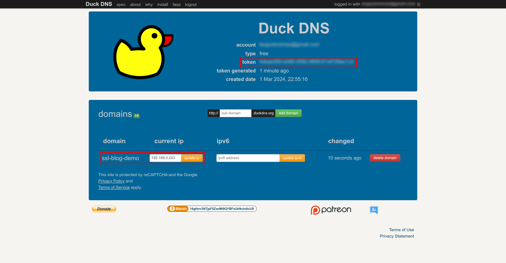
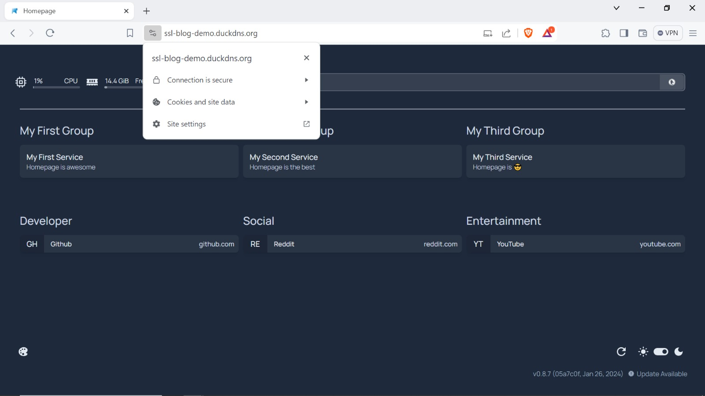
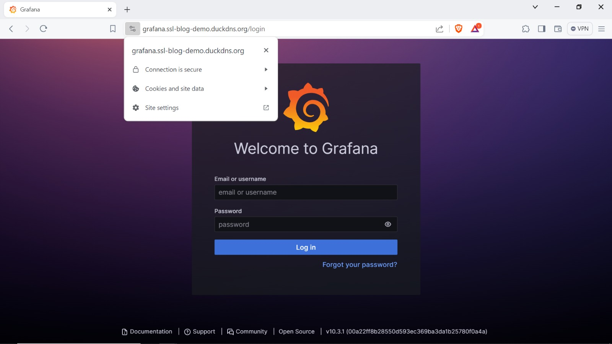
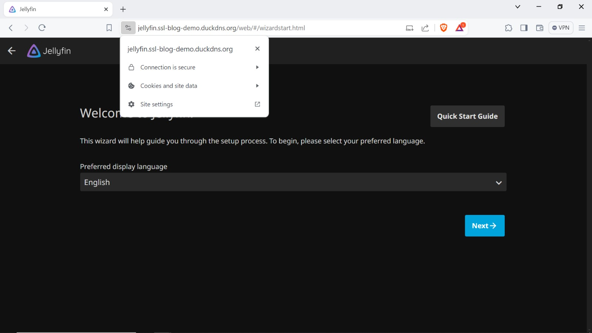

Ultimamente tenho mexido no meu homelab e queria configurar um domínio personalizado com certificados SSL wildcard para todos os meus serviços. Além disso, não queria expor nenhum dos serviços à internet, então um desafio ACME HTTP-01 tradicional não ia servir.

Me deparei com este [excelente blogpost](https://notthebe.ee/blog/easy-ssl-in-homelab-dns01/) do Wolfgang, que explica uma abordagem usando o desafio ACME DNS-01 para eliminar a necessidade de expor qualquer serviço à internet. Testei e funcionou muito bem, mas queria usar o [Caddy](https://caddyserver.com/) como um proxy reverso, porque acho mais fácil configurar e reproduzir do que o [Nginx Proxy Manager](https://nginxproxymanager.com/). Mexi um pouco na configuração do Caddy e cheguei a uma configuração com a qual estou bastante satisfeito, e é isso que vou compartilhar neste post.

# Pré-requisitos

Nesse guia vou assumir que você já tem uma distribuição Linux com Docker instalado no seu home server. Estou usando o Ubuntu Server 22.04.3 LTS e o Docker version 25.0.3, mas qualquer distribuição Linux com uma versão razoavelmente recente do Docker deve ser suficiente. Também vou presumir que você está um pouco familiarizado com a linha de comando e com o funcionamento do Docker, HTTP e portas de rede.

# Como funciona?

Num desafio HTTPS-01 tradicional, o Let's Encrypt fornece um token ao cliente ACME, que o armazena no servidor com uma account key. Uma vez que o arquivo está pronto, o Let's Encrypt tenta recuperá-lo fazendo uma requisição HTTP ao servidor. Se a resposta for válida, o certificado é emitido com sucesso. Isso requer que seu servidor esteja exposto à internet para que o Let's Encrypt possa fazer uma requisição HTTP para ele. Também vale destacar que esse método não permite a emissão de certificados wildcard.

Para contornar essas limitações, podemos usar o desafio DNS-01. Esse desafio funciona colocando um valor específico em um registro TXT sob o seu nome de domínio. O Let's Encrypt fornece um token ao cliente ACME. O cliente ACME então cria um registro TXT derivado desse token e uma chave de conta e coloca esse registro em `_acme-challenge.<SEU_DOMÍNIO>`. O Let's Encrypt pode então consultar o sistema DNS para esse registro e, se encontrar correspondência, o certificado pode ser emitido com sucesso. O interessante desse método é que não é necessário expor o servidor à internet.

Se você quiser saber mais sobre os diferentes tipos de desafios ACME, recomendo fortemente a [documentação](https://letsencrypt.org/docs/challenge-types/) do Let's Encrypt sobre o assunto. Aprendi a maior parte dessas informações lá.

# Configurando o registro DNS

O primeiro passo é obter um nome de domínio e apontar esse domínio para o **endereço IP local** do nosso servidor. Existem vários provedores de nomes de domínio por aí, mas uma opção boa e gratuita é o [Duck DNS](https://www.duckdns.org/). Tenho tido uma boa experiência usando ele no meu homelab, então vou usá-lo neste guia. Caso prefira, você pode usar qualquer provedor de DNS, desde que ele suporte desafios DNS-01.



Anote o seu token Duck DNS. Vamos usá-lo para configurar o Caddy na próxima etapa.

# Estrutura de diretórios

Neste guia, vamos rodar alguns serviços usando `docker compose`. A estrutura de diretórios deve ficar assim:

```text
.
├── docker-compose.yml
├── caddy
│   ├── Caddyfile
│   └── Dockerfile
└── homepage
```

# Configurando o Caddy

Usaremos a [imagem Docker oficial](https://hub.docker.com/_/caddy) do Caddy para configurar e executar nosso proxy reverso.

O Caddy tem o conceito de [módulos](https://caddyserver.com/docs/modules/) que são basicamente plugins para estender sua funcionalidade. Existem vários módulos que fornecem integração com diferentes provedores DNS sob a organização [caddy-dns](https://github.com/caddy-dns) no GitHub. Vamos usar o [módulo duckdns](https://github.com/caddy-dns/duckdns) porque é o provedor DNS que estamos usando neste guia, mas você pode escolher outro módulo de acordo com o seu provedor DNS.

Para usar os módulos do Caddy, precisamos construir um binário personalizado usando a ferramenta [xcaddy](https://github.com/caddyserver/xcaddy). Felizmente, o Caddy fornece uma imagem Docker sob a tag `<versão>-builder` que nos ajuda a construir imagens Docker personalizadas com os módulos de que precisamos. Vamos definir nosso `Dockerfile` da seguinte forma:

```dockerfile
FROM caddy:2-builder AS builder

RUN xcaddy build --with github.com/caddy-dns/duckdns

FROM caddy:2

COPY --from=builder /usr/bin/caddy /usr/bin/caddy
```

Usamos uma [multi-stage build](https://docs.docker.com/build/building/multi-stage/) que constrói nosso binário personalizado com o módulo duckdns e o copia para a imagem Docker padrão. Isso garante que a imagem final não contenha dependências de build, reduzindo seu tamanho.

Em seguida, precisamos configurar nosso `Caddyfile` para que o Caddy gerencie os certificados para nossos domínios usando o módulo duckdns e atue como um proxy reverso para nossos serviços. Neste exemplo, quero acessar meu serviço [homepage](https://gethomepage.dev/latest/) usando o domínio ssl-blog-demo.duckdns.org e acessar meus outros serviços usando os subdomínios \*.ssl-blog-demo.duckdns.org.

```caddyfile
ssl-blog-demo.duckdns.org {
    tls {
        dns duckdns {env.DUCKDNS_API_TOKEN}
    }

    reverse_proxy localhost:3000
}

*.ssl-blog-demo.duckdns.org {
    tls {
        dns duckdns {env.DUCKDNS_API_TOKEN}
    }

    @jellyfin host jellyfin.ssl-blog-demo.duckdns.org
    handle @jellyfin {
        reverse_proxy localhost:8096
    }

    @grafana host grafana.ssl-blog-demo.duckdns.org
    handle @grafana {
        reverse_proxy localhost:3001
    }
}
```

Neste exemplo, o Caddy vai solicitar e gerenciar automaticamente um certificado para `ssl-blog-demo.duckdns.org` e um certificado wildcarded para `*.ssl-blog-demo.duckdns.org`. Definimos as regras do proxy reverso usando o host das requisições para corresponder à porta do serviço na máquina local. Observe também que fazemos referência a uma variável de ambiente `DUCKDNS_API_TOKEN`, para que não precisemos expor essa informação no arquivo de configuração.

Em seguida, declaramos nossos serviços usando um arquivo docker compose. Eu preparei um `docker-compose.yaml` de exemplo para esse guia com alguns serviços apenas para fins de demonstração. O nosso principal foco de atenção é o serviço `caddy`.

Note que especificamos a variável de ambiente `DUCKDNS_API_TOKEN` no serviço `caddy`. Você deve configurar essa variável com o valor do token do Duck DNS que foi obtido no primeiro passo desse guia.

Também é importante montar um volume persistente no caminho `/data` no serviço `caddy`, pois é onde os arquivos de certificado são armazenados e não queremos perdê-los se o contêiner for recriado.

```yaml
version: "3.8"

volumes:
  caddy_data:
  caddy_config:

services:
  caddy:
    build:
      dockerfile: "./caddy/Dockerfile"
    container_name: caddy
    restart: unless-stopped
    network_mode: host
    volumes:
      - ./caddy/Caddyfile:/etc/caddy/Caddyfile
      - caddy_data:/data
      - caddy_config:/config
    environment:
      DUCKDNS_API_TOKEN: <SEU_TOKEN_DUCKDNS_API>

  homepage:
    image: ghcr.io/gethomepage/homepage:latest
    container_name: homepage
    restart: unless-stopped
    ports:
      - 3000:3000
    volumes:
      - ./homepage:/app/config
      - /var/run/docker.sock:/var/run/docker.sock

  grafana:
    image: grafana/grafana:latest
    container_name: grafana
    restart: unless-stopped
    ports:
      - 3001:3000

  jellyfin:
    image: lscr.io/linuxserver/jellyfin:nightly
    container_name: jellyfin
    restart: unless-stopped
    environment:
      - PUID=1000
      - PGID=1000
      - TZ=America/Sao_Paulo
      - JELLYFIN_PublishedServerUrl=192.168.0.243
    ports:
      - 8096:8096
```

E é isso! Executar `docker compose up` no diretório atual deve iniciar todos os serviços, e devemos poder acessá-los usando nosso domínio e verificar que temos certificados SSL válidos.

Ao acessar a URL `ssl-blog-demo.duckdns.org`, podemos verificar que a requisição é redirecionada para o serviço homepage, e o certificado SSL é válido.



Isso também vale para os serviços sob o domínio wildcarded:





Com essa configuração, adicionar novos serviços e domínios é apenas uma questão de adicionar uma nova entrada no `Caddyfile`.
