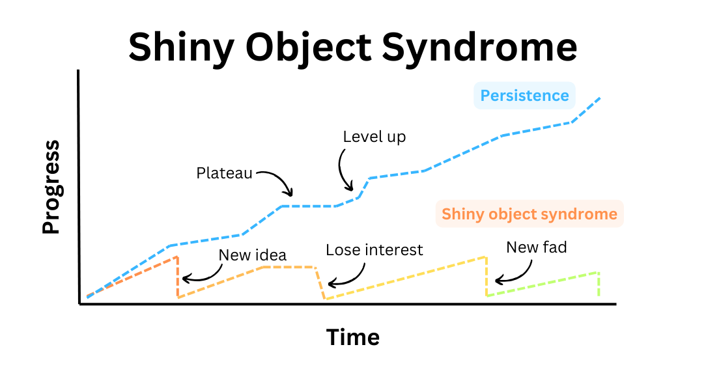

Shiny object syndrome é a condição na qual uma pessoa **constantemente inicia novas atividades** porque elas parecem divertidas e interessantes, ignorando suas metas atuais e atividades em andamento. Eu pessoalmente sofri e ainda sofro bastante com essa condição, mas a aceitação é o primeiro passo para a melhoria.

O perigo da síndrome do objeto brilhante é que **à primeira vista ela é vista como virtuosa**, como uma característica de uma pessoa curiosa e versátil. Na prática, é muito prejudicial para objetivos de longo prazo. À medida que o indivíduo continua alternando entre várias atividades sem ter a chance de fazer progressos significativos em nenhuma delas, torna-se o famoso "Jack of all trades, master of none".

No final do dia, essas novas ideias e atividades são apenas **distrações dos objetivos e atividades principais que realmente nos importamos**. Trocamos nosso sucesso e realização a longo prazo pela gratificação instantânea e sentimento de produtividade.

Uma das causas disso é o FOMO (Fear of missing out): sempre queremos estar atualizados com as ideias mais recentes e empolgantes. Mas acho que outra e talvez mais profunda motivação para essa condição é que **queremos sentir a sensação de realização de começar algo novo** (o pico do "Monte Estúpido" no Efeito Dunning-Kruger), mas não gostamos do desconforto dos platôs e dificuldades que surgem quando nos aprofundamos um pouco mais em qualquer assunto. Então, para evitar esse desconforto, desistimos cedo de nossas empreitadas para começar alguma outra atividade e imediatamente obter aquela gratificação de iniciante.

Esse fenômeno pode ser observado em todas as áreas da vida. Alguns exemplos são:

1. Um iniciante na musculação que muda a rotina a cada duas semanas sem ter a chance de realmente ver os resultados e avaliar nenhuma delas
2. Um programador que aprende o básico de cada nova ferramenta/framework e acaba não sendo capaz de construir nada com nenhuma delas
3. Um usuário de Linux que troca de distribuição sem realmente aprender a usar qualquer uma delas adequadamente

A coisa mais importante para superar essa condição é aceitar que **não podemos fazer tudo**, e confiar que se dedicar às suas atividades atuais será muito mais frutífero do que perseguir novidades brilhantes.

> Apenas persista tempo suficiente e você entenderá por que começou aquilo em primeiro lugar.

# Referências

https://en.wikipedia.org/wiki/Shiny_object_syndrome

https://www.skool.com/synthesizers/techniques-to-overcome-shiny-object-syndrome
